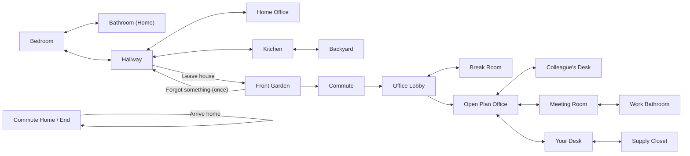
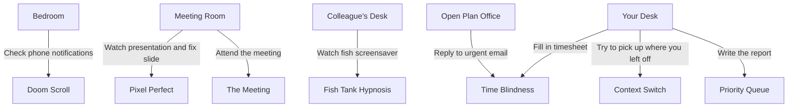
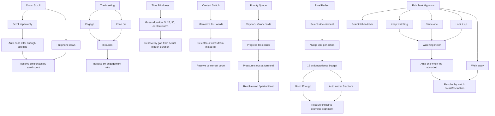

# Game Map

This map reflects the current room graph, major choices, and mini games.

## Rendered Images

- [Room Flow](./game-map-images/01-room-flow.png)
- [Mini Game Triggers](./game-map-images/02-mini-game-triggers.png)
- [Choice Map](./game-map-images/03-choice-map.png)
- [Mini Game Internals](./game-map-images/04-mini-game-internals.png)
- [Ending Logic](./game-map-images/05-ending-logic.png)

## Room Flow



## Mini Game Map



## Choice Map

```mermaid
flowchart TD
  start["Start: Bedroom"]

  start -->|"Get medication from bedside drawer"| takeMedsItem["Item: meds"]
  start -->|"Take medication"| tookMeds["Action: took meds"]
  start -->|"Pick up phone"| phone["Item: phone"]
  start -->|"Check phone notifications"| doom["Mini game: Doom Scroll"]
  start -->|"Stare at ceiling"| ceiling["Distraction"]
  start --> bathroomHome["Bathroom (Home)"]
  start --> hallway["Hallway"]

  bathroomHome -->|"Brush teeth"| brushed["Action: brushed teeth"]
  bathroomHome -->|"Look in mirror"| mirror["Distraction"]
  bathroomHome -->|"Have shower"| shower["Distraction"]
  bathroomHome --> start

  hallway -->|"Search for keys"| keySearch["Distraction"]
  hallway -->|"Check key bowl"| keys["Item: keys"]
  hallway -->|"Try to leave (blocked)"| blockedLeave["Examine"]
  hallway -->|"Leave house"| frontGarden["Front Garden"]
  hallway --> homeOffice["Home Office"]
  hallway --> kitchen["Kitchen"]

  homeOffice -->|"Look for report draft"| reportDraft["Item: report draft"]
  homeOffice -->|"Grab headphones"| headphones["Item: headphones"]
  homeOffice -->|"Check computer just quickly"| tabs["Distraction"]
  homeOffice --> hallway

  kitchen -->|"Make coffee"| coffee["Item: coffee"]
  kitchen -->|"Eat something"| breakfast["Action: ate breakfast"]
  kitchen -->|"Skip breakfast"| skipBreakfast["Examine"]
  kitchen -->|"Check phone while waiting for kettle"| kettleScroll["Distraction"]
  kitchen -->|"Look for travel card"| travelCard["Item: travel card"]
  kitchen --> backyard["Backyard"]
  kitchen --> hallway

  backyard -->|"Water plant"| plant["Distraction"]
  backyard -->|"Stand here"| stand["Examine"]
  backyard --> kitchen

  frontGarden -->|"Forgot something (once)"| hallway
  frontGarden -->|"Investigate shiny thing"| shiny["Distraction"]
  frontGarden -->|"Work out bin day"| bins["Distraction"]
  frontGarden --> commute["Commute"]

  commute -->|"Listen to podcast"| podcast["Distraction"]
  commute -->|"Plan day in head"| planned["Action: planned day"]
  commute -->|"Scroll phone whole journey"| commuteScroll["Distraction"]
  commute --> officeLobby["Office Lobby"]

  officeLobby -->|"Badge in"| badge["Action: badge in"]
  officeLobby -->|"Conversation trap"| lobbyChat["Distraction"]
  officeLobby --> breakRoom["Break Room"]
  officeLobby --> openPlan["Open Plan Office"]

  breakRoom -->|"Get coffee"| officeCoffee["Item: coffee"]
  breakRoom -->|"Drink coffee"| drankCoffee["Action: drank coffee"]
  breakRoom -->|"Read fridge note"| fridgeNote["Distraction"]
  breakRoom --> officeLobby

  openPlan -->|"Check emails"| checkedEmails["Action: checked emails"]
  openPlan -->|"Reply urgent email"| timeBlind["Mini game: Time Blindness"]
  openPlan -->|"Reorganise desk area"| reorganise["Distraction"]
  openPlan --> colleagueDesk["Colleague's Desk"]
  openPlan --> meetingRoom["Meeting Room"]
  openPlan --> yourDesk["Your Desk"]
  openPlan --> officeLobby

  colleagueDesk -->|"Wait for colleague"| colleagueWait["Distraction"]
  colleagueDesk -->|"Watch fish screensaver"| fishTank["Mini game: Fish Tank Hypnosis"]
  colleagueDesk --> openPlan

  meetingRoom -->|"Attend meeting"| meetingGame["Mini game: The Meeting"]
  meetingRoom -->|"Attend mentally optional"| zoneOut["Distraction"]
  meetingRoom -->|"Watch presentation and fix slide"| pixelPerfect["Mini game: Pixel Perfect"]
  meetingRoom --> bathroomWork["Work Bathroom"]
  meetingRoom --> openPlan

  bathroomWork -->|"Bathroom break"| bathroomBreak["Action: bathroom break"]
  bathroomWork -->|"Check phone because quiet"| bathroomPhone["Distraction"]
  bathroomWork --> meetingRoom

  yourDesk -->|"Write report"| priority["Mini game: Priority Queue"]
  yourDesk -->|"Fill timesheet"| timeBlindDesk["Mini game: Time Blindness"]
  yourDesk -->|"Pick up where left off"| contextSwitch["Mini game: Context Switch"]
  yourDesk -->|"Send report"| sentReport["Action: sent report"]
  yourDesk -->|"Headphones focus"| deepWork["Action: deep work"]
  yourDesk -->|"Look something up just quickly"| rabbitHole["Distraction"]
  yourDesk --> supplyCloset["Supply Closet"]
  yourDesk --> openPlan

  supplyCloset -->|"Use label maker"| labelMaker["Distraction"]
  supplyCloset -->|"Sit in mysterious chair"| chair["Action: found chair"]
  supplyCloset --> yourDesk
```



## Mini Game Internals



## Ending Logic

```mermaid
flowchart TD
  end["End of day"] --> never["THE HOUSE WON\nnever reached front garden / commute / office and time <= 10"]
  end --> office["OFFICE, TECHNICALLY\nreached office and time/focus hit 0"]
  end --> transit["LOST IN TRANSIT\nreached commute, not office, and time/focus hit 0"]
  end --> noMeds["RUNNING ON VIBES\nbadged in without taking meds"]
  end --> closet["THE CLOSET UNDERSTANDS\nfound supply closet chair"]
  end --> functional["SOMEHOW FUNCTIONAL\nall core tasks, enough focus/time"]
  end --> productive["PRODUCTIVE CHAOS\nall core tasks regardless of stats"]
  end --> survived["SURVIVED. BARELY.\n4+ completed actions and time > 0"]
  end --> void["THE HYPERFOCUS VOID\nchaos >= 80 and time > 0"]
  end --> chaos["CHAOS CONSUMED YOU\nfallback"]
```
